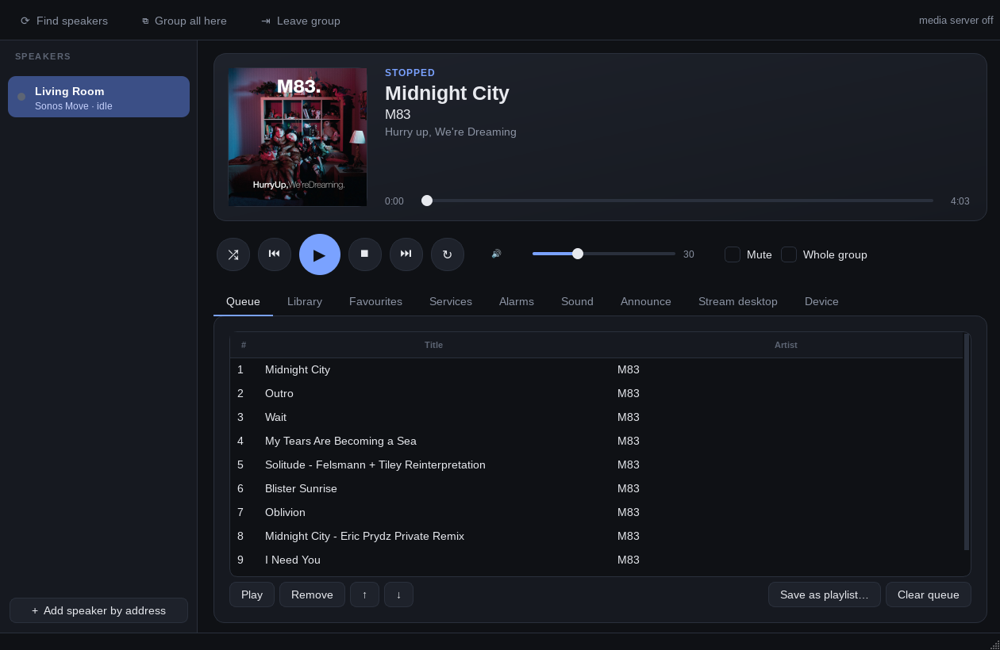
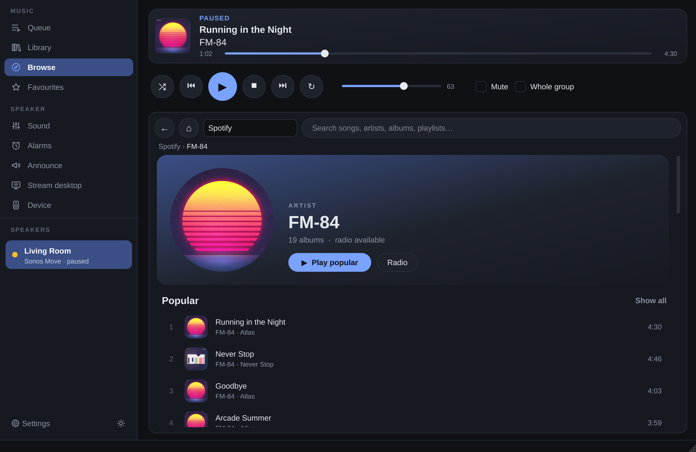
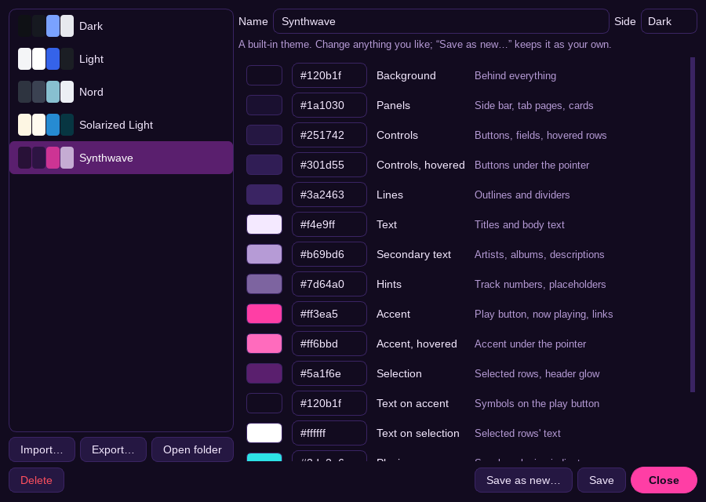

# Sonolin

A Sonos controller for the Linux desktop, written entirely in Python. It is based on
[noson-app](https://github.com/janbar/noson-app).



## Install

```bash
pip install -e '.[gui]'
python3 -m sonolin.desktop install   # adds Sonolin to your application menu
```

Requires Python 3.11 or newer.

Optional system tools:
- `ffmpeg` — stream desktop audio to a speaker (`pactl`, from PulseAudio or PipeWire, is used to list sources)
- `espeak-ng` — text-to-speech announcements

## Run it

Launch **Sonolin** from your application menu, or run:

```bash
sonolin-gui
```

## What it does

- **Playback & Queue:** Play, pause, skip, seek, shuffle, repeat, sleep timer, and full queue management (reorder, clear, or save as a playlist).
- **Music services:** Browse and search Spotify, Apple Music, TuneIn, and others with artist pages, album covers, and personal mixes.
- **Local music library:** Play your local audio files (FLAC, MP3, M4A, Ogg, Opus) with automatic metadata and cover art.
- **Desktop audio streaming:** Stream whatever audio your computer is playing directly to any Sonos speaker.
- **Announcements:** Speak text or play chimes over active music with automatic audio ducking.
- **Room & Group controls:** Group/ungroup speakers, create stereo pairs, adjust individual or group volume, and switch to line-in or TV.
- **Sound settings:** Bass, treble, balance, loudness, and soundbar options (speech enhancement, night mode).
- **Desktop integration:** Control playback with media keys, lock screen widgets, and system notifications via MPRIS.
- **Custom themes:** Light and dark modes with a built-in theme editor and built-in palettes (Nord, Solarized, Synthwave).



## Making a theme



The easiest way is the built-in editor. Open **Settings › Themes…**, pick a
theme, and click any colour to change it. The app changes colour as you go.
When you like it, press **Save as new…** to keep it. If you close without
saving, your old colours come back.

To share a theme, press **Export…** to save it as a file. To use a theme
someone sent you, press **Import…**.

### Writing a theme by hand

A theme is a short text file like this one:

```json
{
  "name": "Coral",
  "base": "light",
  "colors": { "accent": "#ff6b6b" }
}
```

- **name** is what the theme is called.
- **base** is the theme it starts from: `dark` or `light`.
- **colors** lists only the colours you want to change. Everything else comes
  from the base.

So this example is the light theme with a coral play button and highlights.

Save the file with a name ending in `.json`, then import it, or copy it into
`~/.config/sonolin/themes/`. To see every colour you can change, export any
theme and open the file. If your file has a mistake, Sonolin tells you what is
wrong and where.

## Playing music from your computer

Sonos speakers can't read files on your computer. So when you play your own
music, an announcement or your desktop's sound, Sonolin shares it through a
small built-in server that the speaker fetches from.

- It uses port **1405**. If you already opened ports 1400–1410 for noson-app,
  you're set.
- Only your music library is shared, nothing else on your disk. While Sonolin is
  open, anyone on your home network can reach that music.
- Your own songs in the queue only play while Sonolin is open. To keep them
  playing without the window, run `sonolin serve`.

## How Sonolin talks to your speakers

Sonolin controls your speakers directly over your home network. No Sonos
account or cloud is needed.

- **UPnP (port 1400):** playback, queue, playlists, alarms, grouping and sound
  settings.
- **Local WebSocket API (port 1443):** announcements that play over your music
  without stopping it.
- **Diagnostic pages (port 1400):** battery, Wi-Fi and more. Try `sonolin diag`.

### Trusting a speaker for announcements

Before using announcements or other WebSocket controls, explicitly trust the
speaker's TLS certificate. Sonolin refuses connections without a matching pin;
discovery and the public API key do not authenticate a speaker.

Obtain the certificate through a trusted connection to the intended speaker
(for example, an isolated network containing only your computer and that speaker):

```bash
openssl s_client -connect 192.168.1.14:1443 </dev/null 2>/dev/null \
  | openssl x509 -noout -fingerprint -sha256
```

Close Sonolin, then add a `websocket_fingerprints` object to
`$XDG_CONFIG_HOME/sonolin/config.json` (normally `~/.config/sonolin/config.json`),
preserving other settings. Map the speaker's IP to the 64 hex digits printed
after `=`, with or without colons:

```json
"websocket_fingerprints": {"192.168.1.14": "<verified SHA-256 fingerprint>"}
```

Never enroll a certificate obtained only over a potentially intercepted network.
Pins persist across restarts and are never learned or replaced automatically.
If a speaker changes IP, update the mapping after verifying the device. If its
certificate changes, verify the replacement through a trusted connection before
updating the pin. Existing installations must enroll their speakers too.

## Compared with noson-app

**What Sonolin adds**

- Announcements: say a message or play a chime over your music, and the music
  carries on afterwards.
- Stereo pairs: turn two matching speakers into a left and right pair.
- Battery level for portable speakers like the Move and Roam.
- Left/right balance, and speech enhancement for soundbars.
- Control of the speaker's status light and a lock for its touch buttons.
- A Spotify browser that shows your personal mixes, like Discover Weekly,
  first, and gives every artist their own page.
- Your own colour themes, made in a built-in editor.

## File locations

- Settings: `~/.config/sonolin/config.json`
- Music-service logins: `~/.config/sonolin/service_tokens.json`
- Cover art cache: `~/.cache/sonolin/` (up to 250 MB)

## Licence

GPL-3.0.
